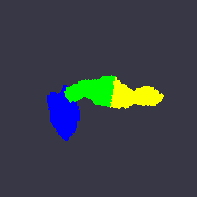

# pancreas-segmentation-parts

Automatically partition a 3-D pancreas segmentation into its anatomical subcomponent parts, head, body and tail.





### Available methods

Two methods are available. They both require a 3-D whole-pancreas segmentation as input.

1) **Registration-based** segmentation, where a parts template is registered towards a new subject, as per Triay Bagur et al., 2022 ([https://doi.org/10.1002/jmri.28098](https://doi.org/10.1002/jmri.28098)).

2) **K-means** based registration inspired in Fontana et al., 2016 ([https://doi.org/10.1120/jacmp.v17i5.6236](https://doi.org/10.1120/jacmp.v17i5.6236)), in which the 3-D coordinates of the whole segmentation are clustered into 3 labels.


### Input & output formats

The methods take a [NIfTI-1](https://nifti.nimh.nih.gov/) label image as input and returns a multi-label image with each part as a separate label: head = 1, body = 2, tail = 3.

The input image needs to have isotropic resolution. The software was mainly tested using 2 mm isotropic data. You may resample your dataset of interest to isotropic resolution using [AFNI software (3dresample)](https://afni.nimh.nih.gov/pub/dist/doc/program_help/3dresample.html):

```
3dresample -dxyz 2 2 2 -rmode NN -prefix $output_seg_2mm_iso -input $input_seg
```

Example input and output data is provided in the `example_data` folder:

* `pancreas_seg.nii.gz` example input segmentation
* `pancreas_seg_parts_gwr.nii.gz` output from registration-based method
* `pancreas_seg_parts_kmeans.nii.gz` output from K-means method


### Software requirements

* MATLAB(R) (Tested using MATLAB R2021b).
* Statistical Parametric Mapping SPM12 which can be downloaded [here](https://www.fil.ion.ucl.ac.uk/spm/software/spm12/).


### Examples

##### Run segmentation by registration to group template (Triay Bagur et al., 2022)

```
runpartsseg('./example_data/pancreas_seg.nii.gz', 'gwr')
```

##### Run parts segmentation by K-means (Fontana et al., 2016)

```
runpartsseg('./example_data/pancreas_seg.nii.gz', 'kmeans')
```

##### Visualise input segmentation / output parts segmentation

```
% Input segmentation
wholeseg = spm_read_vols(spm_vol('example_data/pancreas_seg.nii.gz'));
clrs=[0 0 0; 1 0 0];
figure; labelvolshow(wholeseg,'LabelColor',clrs);

% Output segmentation
partsseg = spm_read_vols(spm_vol('example_data/pancreas_seg_parts_gwr.nii.gz'));
clrs=[0 0 0; 0 0 1; 0 1 0; 1 1 0];
figure; labelvolshow(partsseg,'LabelColor',clrs);
```


### Contributors

Alex Triay Bagur - Institute of Biomedical Engineering, University of Oxford // Perspectum Ltd ([research profile](https://eng.ox.ac.uk/people/alex-triay-bagur/))


### Disclaimer

This software is intended purely for research purposes. It should not be used for medical or professional advice. Use at your own risk.

The University of Oxford and Perspectum Ltd do not give any representation or warranty nor assume any liability or responsibility for the service or the results posted (whether as to their accuracy, completeness, quality or otherwise).

The software is distributed under MIT License.
